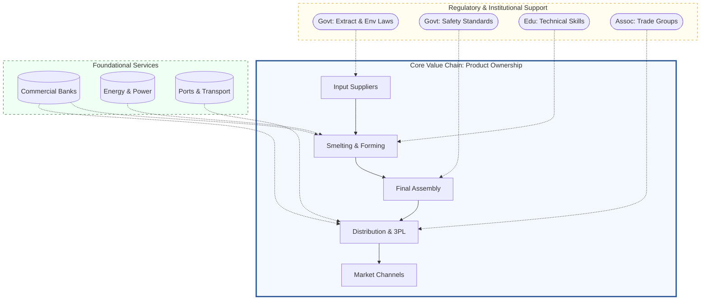

```mermaid
graph TD
    %% ---------------------------------------------------------
    %% 1. SUPPORTING SERVICES (Top Row)
    %% ---------------------------------------------------------
    subgraph Support [Regulatory & Institutional Support]
        direction LR
        S1([Govt: Extract & Env Laws])
        S2([Govt: Safety Standards])
        S3([Edu: Technical Skills])
        S4([Assoc: Trade Groups])
    end

    %% ---------------------------------------------------------
    %% 2. CORE VALUE CHAIN (Middle Row - The "Spine")
    %% ---------------------------------------------------------
    subgraph Core [Core Value Chain: Product Ownership]
        direction LR
        Inputs[Input Suppliers] --> Process[Smelting & Forming]
        Process --> Assembly[Final Assembly]
        Assembly --> Logistics[Distribution & 3PL]
        Logistics --> Retail[Market Channels]
    end

    %% ---------------------------------------------------------
    %% 3. INFRASTRUCTURE & FINANCE (Bottom Row)
    %% ---------------------------------------------------------
    subgraph Infra [Foundational Services]
        direction LR
        F1[(Commercial Banks)]
        F2[(Energy & Power)]
        F3[(Ports & Transport)]
    end

    %% ---------------------------------------------------------
    %% 4. STRATEGIC COUPLING (Connecting the Ecosystem)
    %% ---------------------------------------------------------
    %% Linking Regulators to Core
    S1 -.-> Inputs
    S2 -.-> Assembly
    S3 -.-> Process
    S4 -.-> Logistics

    %% Linking Foundation to Core
    F1 -.-> Process
    F1 -.-> Logistics
    F2 -.-> Process
    F3 -.-> Logistics

    %% STYLING for Readability
    style Core fill:#f4f9ff,stroke:#2b5797,stroke-width:3px
    style Support fill:#fffdf0,stroke:#d4a017,stroke-dasharray: 5 5
    style Infra fill:#f0fff4,stroke:#2e7d32,stroke-dasharray: 5 5
    
    %% Shape Legend (Implicit)
    %% ([ ]) = Regulatory/Govt
    %% [[ ]] = Core Process
    %% [( )] = Infrastructure/Database
```